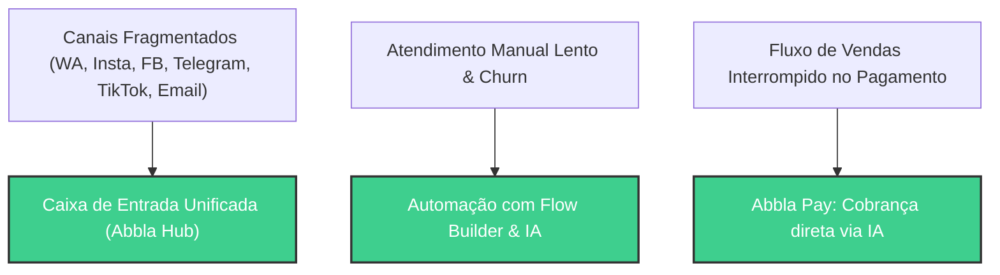
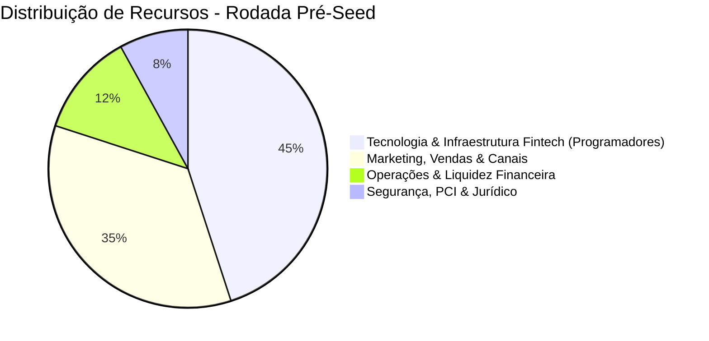

# Relatório de Valuation: Abbla Hub
*Documento de Suporte para Captação de Recursos (Rodada Pré-Seed)*

---

## 1. Sumário Executivo

A **Abbla Hub** é uma plataforma SaaS (Software as a Service) de CRM multicanal e automação conversacional inteligente focada em acelerar vendas e otimizar o atendimento de pequenas e médias empresas (PMEs). A plataforma centraliza os canais de mensagens mais utilizados do mercado — **WhatsApp Cloud API oficial, Instagram Direct, Facebook Messenger, Telegram, TikTok Direct Messages e e-mails** — em uma caixa de entrada unificada colaborativa de alta performance.

Os grandes diferenciais competitivos da Abbla Hub residem em duas frentes inovadoras:
1. **Conectividade de IA via MCP (Model Context Protocol)**: Uma infraestrutura aberta que permite a desenvolvedores e empresas conectarem agentes e assistentes de IA externos (como Cursor, Claude Desktop e LLMs customizados) diretamente aos seus fluxos de mensagens corporativas.
2. **Fintech e E-commerce Conversacional (Abbla Pay)**: Uma camada financeira nativa que permite aos agentes autônomos de IA e atendentes humanos gerarem links de pagamento dinâmicos (Pix, Boleto e Cartão de Crédito) e enviarem cobranças diretamente na janela de chat do cliente. A Abbla Hub monetiza não apenas com assinaturas SaaS, mas também através de um **markup transacional** (taxa sobre o volume financeiro processado pelas subcontas).

Com uma arquitetura escalável, múltiplos canais de receita ativos e ampla multicanalidade integrada, a Abbla Hub está posicionada estrategicamente no cruzamento de CRM, Inteligência Artificial e Fintech na América Latina.

---

## 2. O Problema, a Solução e o Modelo de Monetização Híbrido

### O Problema
1. **Fragmentação de Canais**: PMEs perdem vendas porque as interações com os clientes estão divididas entre WhatsApp, Instagram, Facebook, Telegram, TikTok e E-mail.
2. **Processo de Compra Interrompido**: O cliente decide comprar na conversa, mas o atendente precisa direcioná-lo para um site externo ou gerar manualmente um Pix em outro app de banco, gerando atrito e queda de conversão de até 30%.
3. **Barreira para Monetização de Agentes de IA**: Assistentes conversacionais inteligentes conseguem tirar dúvidas, mas falham em fechar a venda de ponta a ponta (inclusive a transação financeira).

### A Solução
1. **Caixa de Entrada Multicanal Unificada**: Atendimento integrado em WhatsApp, Instagram, Facebook, Telegram, TikTok e E-mail.
2. **Abbla Pay**: O agente de IA ou atendente cria e envia links de pagamento gerados automaticamente em tempo real durante a conversa. O cliente paga via Pix ou cartão sem sair do fluxo de atendimento.
3. **Monetização Híbrida (SaaS + Take Rate)**: A Abbla Hub gera receita recorrente clássica (MRR) e captura uma taxa (take rate/markup) sobre cada transação financeira gerada nas subcontas de seus clientes.

---

## 3. Diferencial Tecnológico & Arquitetura

A arquitetura de software da Abbla Hub garante escalabilidade horizontal massiva com baixíssimo custo operacional fixo (OPEX):

* **Front-end & Server-side**: Construído em **Next.js 16** (React 19, App Router e Server Actions), garantindo uma SPA (Single Page Application) fluida, SEO otimizado e painel administrativo ágil.
* **Banco de Dados & RLS**: **Supabase (PostgreSQL)** com **Row Level Security (RLS)** ativo em todas as tabelas. Contas de clientes e subcontas são isoladas por chave de segurança (`account_id`), eliminando qualquer risco de vazamento de informações.
* **Segurança e Criptografia**: Chaves de API de terceiros (Meta, Telegram, TikTok, SMTP e APIs de Pagamento) são protegidas no banco com criptografia simétrica **AES-256-GCM**.
* **Engine de Integração**: Gerenciamento de eventos assíncronos e processamento em tempo real de webhooks da Meta, Telegram, TikTok e gateways de pagamento fintech.

---

## 4. Tamanho de Mercado (TAM, SAM, SOM)

A adição do modelo de fintech (Abbla Pay) amplia drasticamente o mercado endereçável da startup, somando o mercado de software de CRM com o mercado de meios de pagamento e Pix transacional para PMEs.

* **TAM (Total Addressable Market)**: **R$ 8,5 bilhões**. Composto pelo mercado de CRM conversacional para PMEs no Brasil somado ao mercado de taxas de adquirência (meios de pagamento) para micro e pequenos negócios digitais.
* **SAM (Serviceable Addressable Market)**: **R$ 1,8 bilhão**. Foco em PMEs brasileiras que vendem ativamente pelo WhatsApp, Instagram, Telegram e TikTok e necessitam de soluções de checkout integrado no chat.
* **SOM (Serviceable Obtainable Market)**: **R$ 90 milhões**. Meta de capturar **5% do SAM** em 5 anos, impulsionada pelo efeito viral do checkout conversacional e parcerias com desenvolvedores de IA.

---

## 5. Metodologias de Valuation

Startups SaaS integradas com infraestrutura de pagamento (Fintech-enabled SaaS) possuem múltiplos de valuation superiores aos SaaS tradicionais, devido ao aumento expressivo do LTV do cliente e maior barreira de saída (switching costs).

### A. Método Berkus (Adaptado com Abbla Pay, Telegram & TikTok)
O método Berkus avalia a mitigação de riscos estratégicos em startups pré-seed, atribuindo valores financeiros (até R$ 1.250.000 por pilar) a essa classe de ativos críticos:

| Pilar de Avaliação | Descrição do Status na Abbla Hub | Valor Atribuído |
| :--- | :--- | :--- |
| **1. Valor da Ideia** | CRM Conversacional + IA Autônoma + Conectividade MCP + Abbla Pay (Fintech transacional integrada com Pix/Cartão via IA e e-commerce interno). | **R$ 1.250.000** |
| **2. Protótipo / Tecnologia** | Produto pronto e funcional com integrações ativas: WhatsApp, Instagram, Facebook, Telegram, TikTok, E-mail e barramento de Pagamento. | **R$ 1.250.000** |
| **3. Equipe de Execução** | Capacidade técnica provada com ciclo diário de iteração de código, design premium UI/UX e arquitetura moderna. | **R$ 1.000.000** |
| **4. Alianças Estratégicas** | Conexões oficiais homologadas (Meta Cloud API, Telegram APIs, TikTok APIs) e parceria com gateway de infraestrutura financeira (Abbla Pay). | **R$ 1.000.000** |
| **5. Tração / Clientes Piloto** | Base de dados ativa processando milhares de mensagens de clientes reais e primeiras transações teste de pagamento. | **R$ 750.000** |
| **Valuation Berkus Total** | **Soma dos pilares de mitigação de riscos** | **R$ 5.250.000** |

### B. Custo de Reconstrução da Tecnologia (Cost to Recreate)
Esta abordagem quantifica o valor acumulado no código-fonte e na infraestrutura de integrações da plataforma:

* **Desenvolvimento Sênior (Full-stack & DevOps)**: 1.400 horas de programação focada em CRM multicanal, filas de webhooks, autenticação e split de pagamento: **R$ 210.000**.
* **Integrações de APIs Complexas**: Meta API, Telegram API, TikTok Messenger, E-mail SMTP/IMAP e APIs financeiras criptografadas: **R$ 60.000**.
* **Design de Interface (Flow Builder Visual & UX)**: Construtor visual de automações no-code e telas administrativas: **R$ 50.000**.
* **Custo Regulatório & Segurança (LGPD & PCI Compliance básico)**: Políticas de RLS, criptografia AES-256 e blindagem de dados: **R$ 30.000**.
* **Custo Base da Propriedade Intelectual (IP)**: **R$ 350.000**.

> [!TIP]
> Aplicando um multiplicador de mercado de **15x** devido à inclusão do barramento financeiro integrado (Abbla Pay) e canais Telegram/TikTok/E-mail adicionais, o valuation estimado por essa metodologia é:
> \[\text{Valuation Estimado} = \text{IP} \times 15 = \text{R\$ 5.250.000}\]

### C. Método Scorecard (Comparação com Benchmarks)
No ecossistema brasileiro de startups, SaaS com adquirência embarcada (fintech-enabled) captam rodadas pré-seed com valuations superiores devido ao modelo híbrido de receita.

* **Valuation Base de Startups Fintech-SaaS Pré-Seed no BR**: R$ 5.000.000.
* **Ajustes de Comparação da Abbla Hub**:
  * **Diferencial de IA (MCP)**: 125% (Pioneirismo em conexão aberta de agentes autônomos).
  * **Tamanho de Mercado com Pagamentos**: 120% (Aumento significativo do take rate).
  * **Multicanalidade Integrada (TikTok/E-mail)**: 110% (Solução all-in-one superior à concorrência).
  * **Estágio de Produto**: 110% (Software estável, em produção, pronto para escala).

\[\text{Valuation Scorecard} = \text{R\$ 5.000.000} \times (1,25 \times 1,20 \times 1,10 \times 1,10) \approx \text{R\$ 9.075.000}\]

---

## 6. Valuation Final Sugerido

Adotando uma postura estrategicamente atraente para investidores pré-seed, ancorada na consistência matemática entre as metodologias de mitigação de risco e custo de engenharia:

* **Valuation Pre-Money Adotado**: **R$ 5.250.000**
* **Aporte (Tamanho da Rodada)**: **R$ 750.000**
* **Valuation Post-Money Proposto**: **R$ 6.000.000**

---

## 7. Proposta da Rodada de Captação

A Abbla Hub está captando recursos para impulsionar a infraestrutura financeira da Abbla Pay, acelerar a contratação de programadores focados em tecnologia/fintech e expandir a base de clientes:

* **Tamanho da Rodada**: **R$ 750.000**
* **Participação Oferecida (Equity)**: **12,5%** (calculado de forma exata sobre o Valuation Post-Money de R$ 6.000.000)
* **Instrumento Financeiro**: MÚTUO CONVERSÍVEL EM PARTICIPAÇÃO SOCIETÁRIA.

### Destinação dos Recursos (Use of Funds)

1. **Tecnologia & Infraestrutura Fintech / Contratação de Programadores (45%) - R$ 337.500**
   * **Contratação de 2 Desenvolvedores Sêniores** focados na criação da infraestrutura de e-commerce embarcada da Abbla (banco de dados de produtos, catálogo conversacional e checkout).
   * Integração de gateways de liquidação instantânea (Pix Banco Central) e split de comissionamento automático para subcontas.
2. **Marketing, Vendas & Canais (35%) - R$ 262.500**
   * Aquisição paga em canais focados em desenvolvedores (MCP) e varejistas que vendem via chat (WhatsApp/Telegram/TikTok).
   * Programas de indicação e comissionamento de parceiros integradores.
3. **Operações & Liquidez Financeira (12%) - R$ 90.000**
   * Servidores escaláveis Supabase Pro, Hostinger e gateways de pagamentos.
4. **Segurança, PCI & Jurídico (8%) - R$ 60.000**
   * Adequação regulatória junto ao Banco Central (resoluções de subadquirência) e termos LGPD/PCI para transações financeiras seguras.

---

## 8. Roadmap de Tecnologia e Produto (Aceleração com Recursos da Rodada)

A alocação de recursos da rodada nos permitirá expandir a equipe de desenvolvimento para tirar a Abbla Pay do papel e lançar o inovador recurso de e-commerce integrado:

### Fases do Desenvolvimento do Produto:
* **Mês 01 - Mês 03: Infraestrutura Transacional (Abbla Pay)**
  * Integração técnica com subadquirentes e parceiros bancários para liquidação imediata de Pix e Cartão de Crédito.
  * Desenvolvimento do split de pagamentos automático no banco de dados para garantir que a Abbla retenha o markup das transações.
* **Mês 04 - Mês 06: E-commerce Nativo (Cadastro de Produtos)**
  * **Lançamento do painel de inventário**: O cliente cadastra seus produtos, fotos, preços e estoque direto no painel do CRM.
  * Desenvolvimento do fluxo visual que permite adicionar produtos e carrinho de compras no chat com o cliente final.
* **Mês 07 - Mês 12: Venda Conversacional por IA (Checkout no Chat)**
  * Configuração dos agentes de IA (via MCP e RAG nativo) para lerem o inventário ativo de produtos.
  * Capacitação dos robôs de IA para recomendarem produtos e dispararem a cobrança via Abbla Pay de forma autônoma na conversa quando o cliente manifestar intenção de compra.

### Principais Indicadores Projetados (18 Meses)

* **ARPU SaaS Médio**: R$ 300,00/mês.
* **Volume Financeiro Transacionado Alvo (TPV)**: R$ 5.000.000,00/mês gerado pelas subcontas em 18 meses.
* **Receita de Adquirência Relativa (Take Rate de 1,0%)**: R$ 50.000,00/mês em markup transacional.
* **Meta de Faturamento Mensal (SaaS + Fintech)**: **R$ 150.000,00/mês** em 18 meses (sendo R$ 100.000 de assinaturas recorrentes + R$ 50.000 de comissões Abbla Pay).
* **LTV (Lifetime Value) Híbrido Estimado**: **R$ 5.400,00** por cliente (aumento de 50% em relação ao modelo puramente SaaS devido ao fluxo transacional).
* **Proporção LTV/CAC Alvo**: \(\ge 6:1\) (indicando eficiência mercadológica extremamente alta).

---
*Este relatório de valuation expressa estimativas financeiras fundamentadas na qualidade do produto de software atual e premissas de mercado de CRM e IA no Brasil, devendo servir como documento base para discussões confidenciais com potenciais investidores.*
